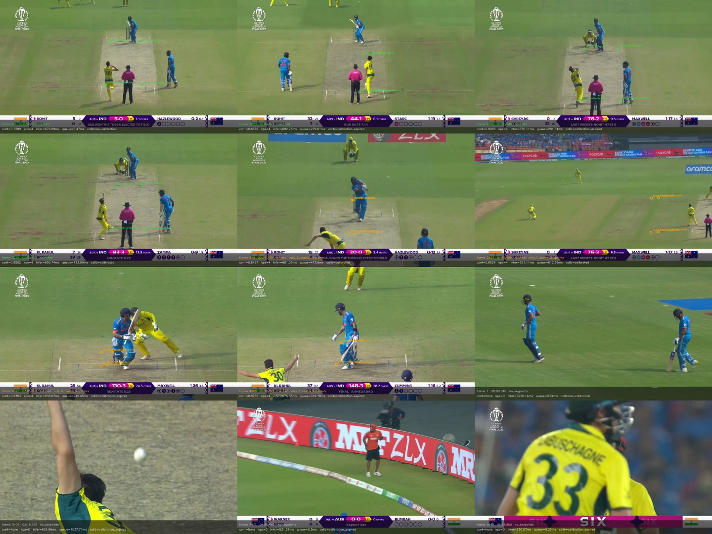

# Pitch attempt log — run `3bb8b971e5564a26`

One row per attempt the worker actually sent to the model. The CSV next
to this file has every column; the montage shows the frames themselves.

## Outcomes

| outcome | attempts | share |
|---|---:|---:|
| no_keypoints | 428 | 87.5% |
| refused | 40 | 8.2% |
| detected | 21 | 4.3% |

## Rejection reasons

| reason | attempts |
|---|---:|
| keypoint_hull_too_small | 15 |
| only_2_usable_keypoints | 12 |
| only_1_usable_keypoints | 8 |
| only_0_usable_keypoints | 5 |

## Calibration state at the attempt

| state | attempts |
|---|---:|
| calibration_expired | 461 |
| calibrated | 20 |
| temporary_loss | 5 |
| no_calibration | 3 |

## Summary recorded by the run

```json
{
  "detections": 21,
  "detector_error": null,
  "failures": 428,
  "queue_drops": 203,
  "refusals": 40,
  "submitted": 692
}
```

## Montage



